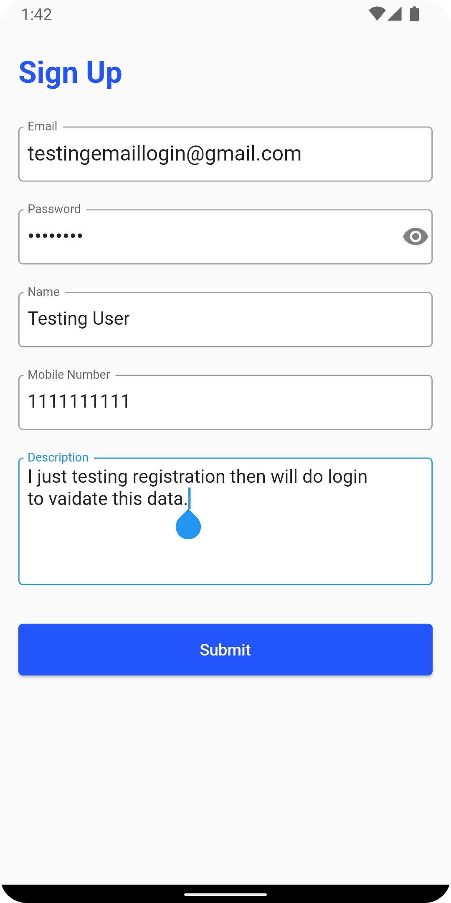
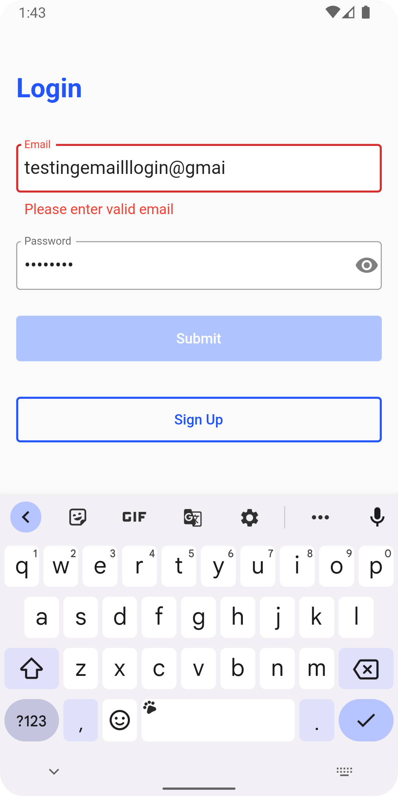
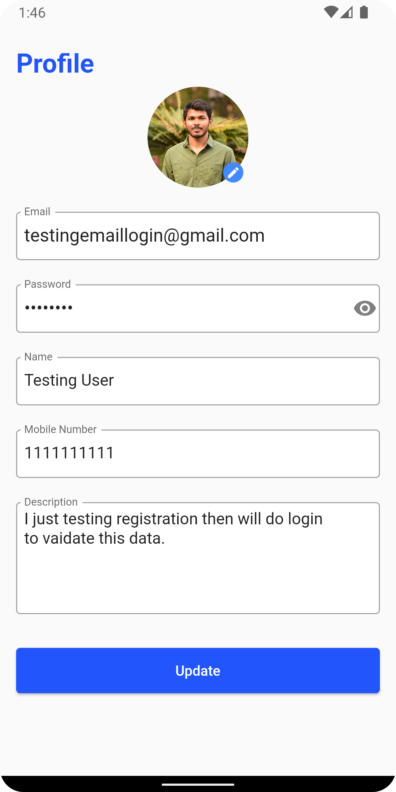

# kodehash_assignment

A new Flutter project with SingIn, SignUp and Profile Screens and Firebase as a backend service.

## Getting Started

To get started with the application you must configure the Firebase first.

Follow till Step 2 from the below link:

[Setup firebase] (https://firebase.google.com/docs/flutter/setup?platform=android)

## Screenshots
    
